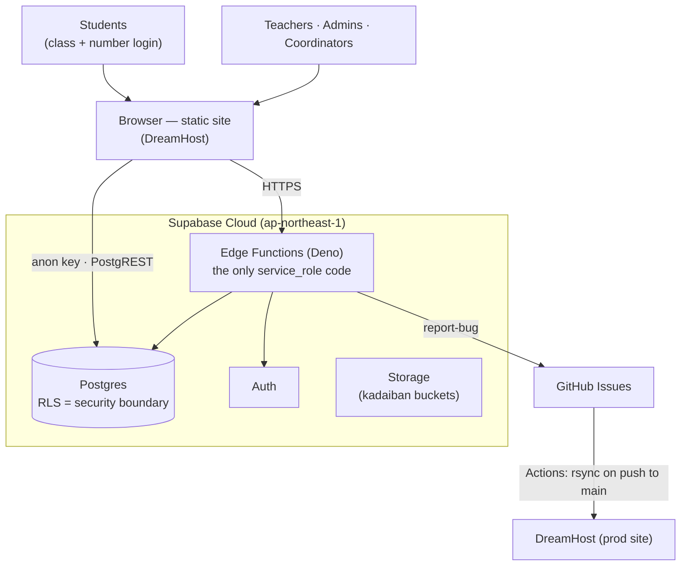
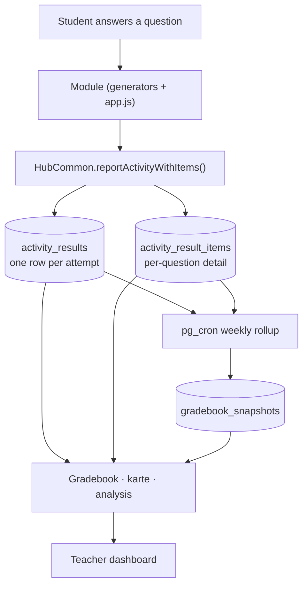

# Gakuenza — Project Handbook

_The canonical orientation document. Last updated: 2026-07-21._

> **Read this first.** This handbook is the canonical orientation document
> for Gakuenza. Every contributor — human or AI — should read it before
> making non-trivial changes. It explains what the system is, how it is
> structured, and where the authoritative documentation lives for each
> domain. It is the **map to the other maps**: where a topic has a dedicated
> deep-reference doc, this handbook summarizes it and points there rather
> than duplicating it (duplication drifts).
>
> **Authority hierarchy** (when documents disagree, higher wins):
> **`CLAUDE.md`** (standing rules) › **`docs/ROADMAP.md`** (live priorities &
> status) › **this handbook** (orientation). This is the orientation layer;
> those are the operational source of truth. All *live numbers* live in
> §11 Quick Reference and the docs it points to — treat counts elsewhere as
> illustrative, not authoritative.

---

## 1. Purpose & product

**Gakuenza (がくえん座)** is a learning platform for Japanese public
elementary schools. It gives **students** self-paced drill practice aligned
to the national curriculum (算数 math, 国語 Japanese, 理科 science, 社会
social studies, 外国語 English), gives **teachers** a gradebook with
per-question analysis and weekly trend snapshots, and gives **school and
platform administrators** the tools to provision classes, staff, and students.

- **Pilot:** 羽咋市立瑞穂小学校 (Mizuho Elementary, Hakui City, Ishikawa) — the
  only school with real student usage today. A second Hakui-city school is
  provisioned but not yet populated (see §11 for live figures).
- **Design ethos:** young children are the primary users, so student surfaces
  favor legibility and low friction (login by class + attendance number, not
  email; passwords in an unambiguous read-aloud alphabet). Content is built
  *original* against the curriculum's skills and facts — never reproducing a
  textbook's actual passages or problems (see "Copyright" in `CLAUDE.md`).

---

## 2. Scope

**In scope (exists today):** a static, framework-free frontend; a Supabase
backend (Postgres + RLS + Auth + Edge Functions + Storage); a complete grades
1–6 core curriculum grid of drill modules; the five-tier role model; a real
gradebook; **Kadaiban (課題板)** handwriting-worksheet submission (first
non-drill feature, first Storage use); an in-app staff bug-report pipeline;
automated deploy on merge.

**Explicitly out of scope** (decided against — see `FEATURE_BACKLOG.md`
R1–R4): student-to-student chat; a student-facing AI tutor; public
leaderboards; a native mobile app.

**The boundary that defines scope:** there is **no application server**. The
browser talks to Postgres directly (PostgREST, public anon key). Everything a
static site cannot safely do — creating accounts, resetting passwords, opening
GitHub issues — lives in a few `service_role` Edge Functions. This keeps the
system cheap and simple and makes **Row-Level Security the real security
boundary, not client code.**

---

## 3. Architecture & infrastructure



- **Frontend:** the `gakuenza.com/` directory, served static on **DreamHost**.
  Nothing outside `gakuenza.com/` ships.
- **Backend:** **Supabase Cloud** (project `ohnsawydclmsrgphasbn`, Postgres 17).
  The anon key is shipped publicly in `hub/config.js` by design.
- **Deploy:** `.github/workflows/deploy.yml` rsyncs (`--delete`) `gakuenza.com/`
  to DreamHost on every push to `main` — **merges go live automatically.**
  Because of `--delete`, renamed/removed files vanish from prod on the next
  deploy (hence the rename/`launch_url` ordering care in §10).
- **Backend deploys separately** from the frontend: schema via the migration
  ledger, Edge Functions via `supabase functions deploy` / MCP
  `deploy_edge_function`. Neither is triggered by the frontend rsync.
- **Known gaps:** DreamHost deploys occasionally fail on a transient SSH
  timeout (a re-run fixes it — not a code issue); there is **no CI test suite**
  despite per-module tests existing (the biggest reliability gap — §8, §10).

---

## 4. How data flows

The gradebook is downstream of a single reporting call. A new contributor
should internalize this path:



The load-bearing rule: **always report through
`HubCommon.reportActivityWithItems(...)`**, never a hand-rolled
`activity_results` insert — because a hand-rolled insert skips
`activity_result_items`, and then the per-question analysis has nothing to
show. Five modules currently violate this (§8 debt #1). Kadaiban grading and
manual score corrections feed the same `activity_results` spine through their
own paths (see `KADAIBAN_design.md`).

---

## 5. The database

Supabase Postgres, all `public` tables RLS-enabled. The deep, policy-by-policy
reference is **`docs/codebase-and-db-structure.md`** (its row counts are stale;
use §11 / live DB for current figures). Tables, by domain:

- **Tenancy & identity:** `schools`, `profiles` (1:1 with `auth.users`;
  `is_platform_admin` is the master key; `home_school_id` intentionally NULL
  for real schools), `school_members` (staff roles), `classes`, `enrollments`
  (student roster), `class_teachers` (who teaches a class).
- **Catalog & assignment:** `modules` (drill catalog), `school_modules`
  (per-school licensing), `class_modules` (per-class assignment; `due_date`,
  `total_items`, `focus_units`).
- **Results & gradebook:** `activity_results`, `activity_result_items`,
  `observation_records`, `grade_corrections` (append-only audit),
  `gradebook_snapshots` (pg_cron rollups).
- **Kadaiban:** `kadaiban_assignments`, `_assignment_pages`, `_submissions`,
  `_submission_pages`.
- **Misc:** `bug_reports` (RLS-enabled with **zero policies** — reachable only
  via the `report-bug` function's `service_role`).

### 5.1 Roles & RLS

RLS is the boundary; client-side tier checks are UX gating only.

| Tier | Determined by | Scope |
|---|---|---|
| **platform_admin** | `profiles.is_platform_admin` | Every school; only tier that creates schools / retires modules. Never client-writable. |
| **school_admin** | `school_members.role='school_admin'` | Full admin of one school. |
| **coordinator** | `school_members.role='coordinator'` | Class/enrollment/assignment mgmt across scoped school(s); no staff creation, password reset, or module licensing. |
| **educator** | `role='educator'` + `class_teachers` | Gradebook for taught classes. |
| **student** | `enrollments.role='student'` | Own practice/results. |

Policies are expressed through `SECURITY DEFINER` helpers
(`app_is_platform_admin`, `app_user_admin_school_ids`,
`app_user_staff_school_ids`, `app_user_taught_class_ids`, `app_user_class_ids`,
`app_class_school`, …); reads/writes are layered self-vs-staff-vs-taught-class.
Full policy detail lives in `codebase-and-db-structure.md`. **Two invariants
that must never regress** (both back real P0s): never `GRANT UPDATE ON
public.profiles` at the table level (reopens an `is_platform_admin`
self-escalation), and new tables must `revoke truncate` from
`anon, authenticated` (Supabase's defaults re-grant it, and TRUNCATE bypasses
RLS).

### 5.2 Edge Functions (the only `service_role` code)

| Function | Public? | Purpose |
|---|---|---|
| `provision-account` | No | Sole privileged account creation (`kind ∈ student/teacher/admin/coordinator`); re-verifies caller is platform/school admin of the target school. |
| `update-student` | No | Edit a student's name/number/class/password. |
| `update-teacher` | No | Top-tier-only edit of staff name/password (excludes coordinators). |
| `student-login` | **Yes** | Login by `{class_id, student_number, password}`; looks up the account then does a real `signInWithPassword`. Enumeration-resistant. |
| `report-bug` | **Yes** | Staff bug button → GitHub issue + `bug_reports` row; verifies JWT + staff role in-code, rate-limited. |

### 5.3 Storage & migrations

Two **private** buckets (`kadaiban-sources`, `kadaiban-submissions`),
path-segment RLS, `authenticated` only. Schema changes go through
`supabase/migrations/` reconciled with the prod ledger — via CLI (`migration
new` + `db push`) or agent/CI (MCP `apply_migration` **plus** the committed
file). Never `execute_sql`/dashboard DDL. **`db/` is a documentation mirror
only, not applied migrations.** Full process: `supabase/README.md`.

---

## 6. The codebase

No build step, no framework — `gakuenza.com/` ships as-is.

```
gakuenza.com/                     ← the ONLY deployed directory
├── *.html, style.css             ← public/marketing (modules must NEVER link style.css)
├── hub/                          ← the authenticated app
│   ├── config.js · supabase.js · hub-common.js · module-assign-common.js
│   ├── hub-shell.css             ← page frame (hub pages may link this)
│   ├── index/login/grades/settings.html, kadaiban.html + kadaiban-draw.js
│   ├── admin/                    ← console: admin-common.js, admin.css (self-contained),
│   │                                schools/teachers/students/class-detail/modules.html
│   └── gradebook/                ← gradebook-common.js + index/assign/roster/analysis/karte/…
└── modules/<key>/                ← drill modules (see §7)

supabase/ · docs/ · tests/ (not wired to CI) · db/ (mirror only) · .github/workflows/
```

**Module system (summary — deep detail in `codebase-and-db-structure.md`):**
each drill is a self-contained `modules/<key>/` dir (`index.html`, generators,
`<key>-report.js`, self-contained `style.css`, optional `units.js`). Unit
scoping is **decentralized** — a module ships its own `units.js`; the
assignment UIs lazy-load it. There is no shared registry and never should be
(the old shared one corrupted under parallel PRs and was deleted).

**The hard rules (from `CLAUDE.md` — each backed by a shipped bug; read
`CLAUDE.md` for the full rationale):**
1. Every module's `style.css` is **fully self-contained** (copies tokens
   literally, never links root `style.css` — its `button{width:100%}` broke
   prod four times).
2. Always report via **`HubCommon.reportActivityWithItems(...)`**, never a
   hand-rolled `activity_results` insert (see §4).
3. Resolve student context via **`enrollments → classes.school_id`**, never
   `profiles.home_school_id`.
4. **`launch_url` is always absolute** (`/modules/<key>/index.html`).
5. **Registration migrations are idempotent**, `is_active` explicit, `subject`
   matching the CHECK constraint, `publisher` included.

---

## 7. Modules (curriculum coverage)

The grades 1–6 core grid is **complete**. Coverage (not a volatile count — see
§11 for the live total):

| Subject | Modules | Coverage |
|---|---|---|
| 算数 math | sansu1–6 | grades 1–6 ✅ |
| 国語 Japanese | kokugo1–6 | grades 1–6 ✅ |
| 理科 science | rika3–6 | grades 3–6 ✅ |
| 社会 social | shakai3–6 | grades 3–6 ✅ |
| 外国語 English | letstry1/2, eigo5, nh6 | grades 3–6 ✅ |
| supplementary | kanken3/4/5, eiken, nhvocab | cross-grade |
| misc | kadaiban | reporting anchor (`is_active=false`) |

(`nh6`'s display name is "外国語 6年" but its `key`/directory stays `nh6`; a
full rekey to `eigo6` is roadmapped low-priority.)

---

## 8. Roadmap & status

**`docs/ROADMAP.md` is authoritative** for priorities, progress, and the full
near-term-debt list; domain detail lives in
`docs/planning/{MODULE_ROADMAP,FEATURE_BACKLOG,UI_REDESIGN,KADAIBAN_design}.md`.

**Current focus areas** (see ROADMAP for the full picture and ordering):
- **Reliability:** stand up a CI test suite (tests exist, nothing runs them);
  pay down RLS performance debt; automate the advisor sweep.
- **Data quality:** migrate the five hand-rolled reporters to populate
  `activity_result_items`; wire `rika3` into `focus_units`.
- **Reach vs. depth:** second-school rollout vs. the P0 product features (F1
  assignment dashboard, F16 offline resilience) — an open decision, with the
  data suggesting real usage is still minimal (favoring adoption first).

The roadmap is deliberately **honest about gaps** (no CI, missing tests, the
five broken reporters, performance debt) — that's a feature of the doc, not an
oversight.

---

## 9. Documentation map & update processes

| Doc | Role | Authority |
|---|---|---|
| `CLAUDE.md` | Standing rules, loaded every session | **Top authority** |
| `docs/ROADMAP.md` | Live priorities, progress, debt | **Authoritative for "what's next" & live status** |
| `docs/PROJECT_HANDBOOK.md` (this) | Orientation / entry point | Overview; defers to the above |
| `docs/codebase-and-db-structure.md` | Deep architecture/DB/RLS map | Deep reference (some counts stale) |
| `docs/planning/*` | Domain detail (modules, features, UI, Kadaiban) | Authoritative per domain |
| `docs/bug-report-automation.md` | The bug pipeline | Authoritative for that subsystem |
| `docs/second-school-onboarding.md` | New-school runbook | Living runbook |
| `supabase/README.md` | Migration workflow | Authoritative for migrations |
| `db/*.sql` | Pre-adoption history | **Mirror only — not applied** |

**Update processes:** the roadmap is edited in place (progress appended, debt
struck through with `done <date> (#N)`); specs flow
`pending/ → (auto-build) → completed/`; migrations follow the ledger
discipline (§5.3). **This handbook** is refreshed when a *structural* fact
changes (a new table/subsystem/role, a change to deploy or the role model) —
not for routine roadmap ticks, and live numbers stay in §11.

---

## 10. Workflows & chain of command

**Automated pipelines** (`.github/workflows/`; all Claude-driven ones use the
subscription token, not API billing):

| Workflow | Trigger | Boundary |
|---|---|---|
| `deploy.yml` | push to `main` | rsync frontend → DreamHost |
| `bug-diagnose.yml` | issue labeled `user-report` | posts a diagnosis comment — **never edits/PRs** |
| `bug-autofix.yml` | issue labeled `approved-for-autofix` (**human gate**) | opens a PR — **never auto-merges** |
| `auto-build-module.yml` | push touching `docs/specs/pending/**` | builds the spec, moves it to `completed/`, opens a PR |

The bug pipeline's **chain of command** is deliberate: auto-diagnose (comment
only) → a **human adds `approved-for-autofix`** → autofix opens a PR → a human
reviews and merges. The staff-only in-app bug button is the entry point.

**Human/agent working discipline** (rationale in `CLAUDE.md`):
- **Branch → PR → review → merge → auto-deploy.** Never push to `main`.
- **Verify, don't trust** — read the actual code before shipping any fix,
  including an auto-diagnosis's proposed one; review auth/RLS/Edge-Function/DB
  paths line by line regardless of what produced the diff.
- **Backend deploy-ordering:** schema via MCP `apply_migration` + committed
  file; registration migrations applied *after* the frontend deploys (else a
  card's `launch_url` 404s); Edge Function source changes require a redeploy
  (backward-compatible ones can go before the frontend); directory/`launch_url`
  renames update the DB right after the deploy (the `--delete` window).
- **No secrets in the repo**; watch for the raw-NUL-byte-in-source class of bug
  (use the `\u0000` escape, never a literal control character).

---

## 11. Quick reference (the single home for live numbers)

_All volatile counts live here; treat figures elsewhere as illustrative.
Snapshot 2026-07-21 — for the current truth query the live DB / `ROADMAP.md`._

- **Schools:** 2 — Mizuho (active; 9 classes, 106 students, 7 staff),
  羽咋小学校 (active; 6 classes, 0 students, 2 staff).
- **Modules:** 30 (japanese 9, english 6, math 6, science 4, social 4, misc 1).
- **DB:** 20 public tables (all RLS-enabled) · 5 Edge Functions · 2 Storage
  buckets · 29 migrations.
- **Supabase:** project `ohnsawydclmsrgphasbn`, ap-northeast-1, Postgres 17
  (free tier — leaked-password protection is a paid feature, currently off).
- **Repo:** `QrowZK/Gakuenza`. **Deploy:** rsync → DreamHost on push to `main`.
- **Advisors (2026-07-20):** no net-new security holes beyond documented
  exceptions; performance debt = 106 lints (78 multiple-permissive-policies,
  13 auth-initplan, 14 unindexed FKs), deferrable at current scale.

---

## 12. Glossary

- **Module** — a self-contained drill app under `gakuenza.com/modules/<key>/`;
  registered as a row in the `modules` table.
- **Kadaiban (課題板)** — the handwriting-worksheet feature: a teacher uploads a
  worksheet image, students annotate it on a canvas and submit, teachers grade.
  First subsystem to use Supabase Storage.
- **Coordinator** — a staff tier with class/enrollment/assignment management
  across one or more schools, but *not* staff creation, password reset, or
  module licensing (a subset of school_admin).
- **`launch_url`** — the absolute path (`/modules/<key>/index.html`) the hub
  uses to open a module; NULL means the module is a catalog/reporting anchor,
  not launchable (e.g. `kadaiban`).
- **`focus_units`** — an optional per-class scoping (`class_modules.focus_units`,
  jsonb) that narrows a module to specific units; NULL = all units.
- **`units.js`** — a module's self-registration of its unit list
  (`window.MODULE_UNITS.<key>`), lazy-loaded by the assignment UIs.
- **RLS (Row-Level Security)** — Postgres per-row access rules; **the** security
  boundary here, since the browser hits the DB directly with a public key.
- **Edge Function** — a Deno serverless function holding `service_role`
  (privileged) code — the only place that can bypass RLS, deliberately.
- **`is_platform_admin`** — the master-key flag on `profiles`; grants control of
  every school. Set only via migration/`service_role`, never client-writable.
- **Ledger** — `supabase_migrations.schema_migrations`, the record of applied
  migrations, reconciled with `supabase/migrations/`.

---

_Maintainers: keep structural facts here in sync with reality; keep live
numbers in §11; push implementation detail into the specialized docs this
handbook references. Resist the drift from orientation layer to encyclopedia —
`CLAUDE.md` and `ROADMAP.md` remain the operational source of truth._
